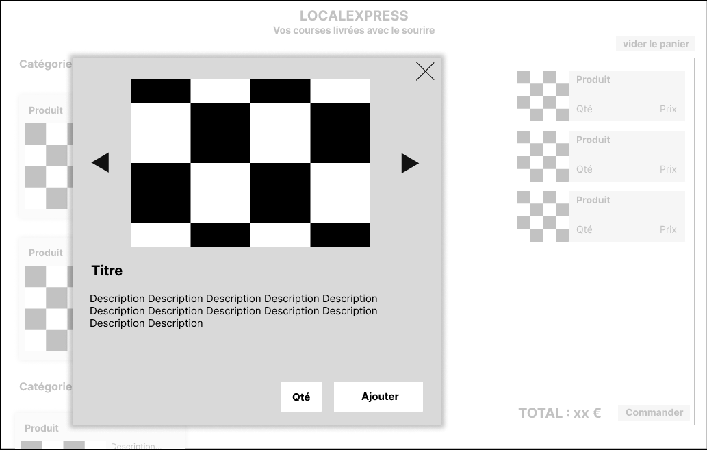
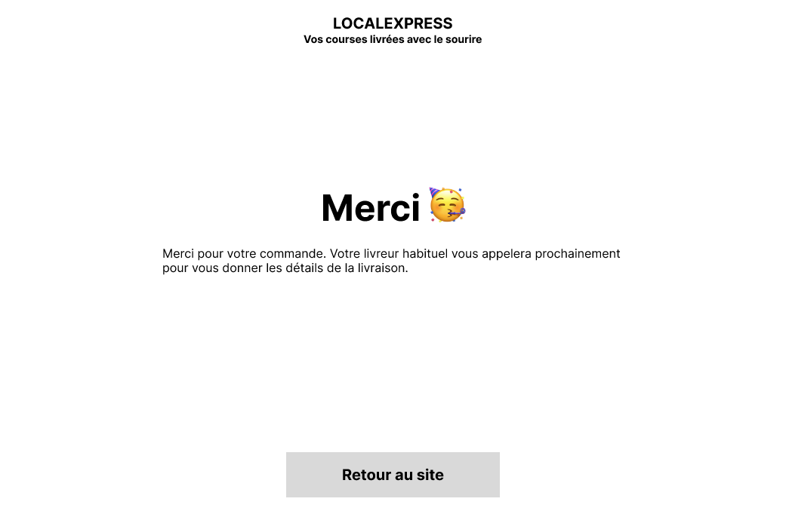
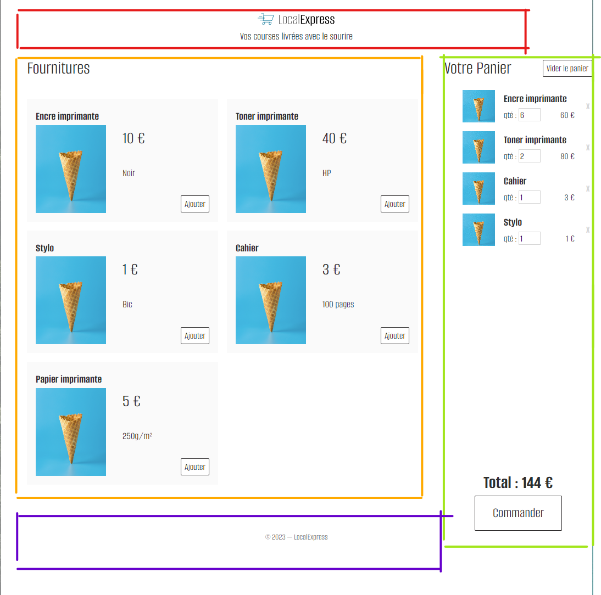
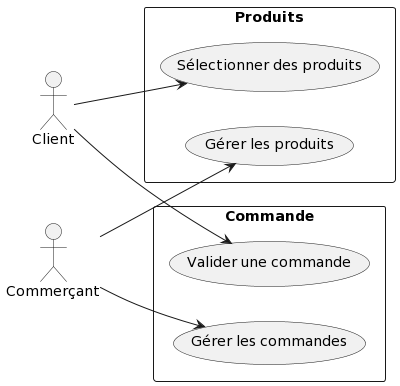
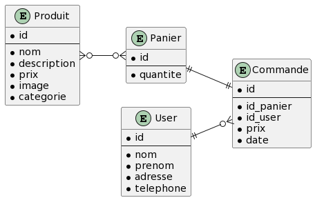
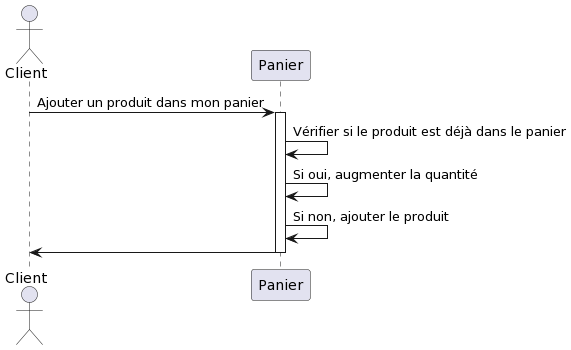
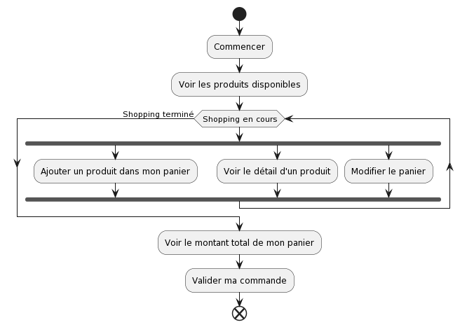

# Cahier des charges

**Société**  localexpress

**Objectif** faire de la livraison de courses à domicile

## Description 

Nous voulons une application web qui permet de commander des produits et de se faire livrer à domicile. Nous ne vendons que quelques produits, qui changent chaque semaine. Il n'est pas nécessaire d'avoir d'historique de commande.

Pour nous démarquer, nous souhaitons :

- Une interface simple, sans navigation. Les produits sont tous sur la même page, simplement rangés par catégories (a-z).
- Compatible smartphone
- Nous privilégions le contact humain
    * paiement à la livraison
    * facture papier (non gérée par l'application)
    * le livreur fera du teasing sur les produits à venir

Nous n'avons pas de contrainte sur la technologie utilisée. Il nous faudra juste un back-office pour gérer les produits et voir les commandes.

## Interface

Voici une idée de l'interface que nous imaginons. Nous ne sommes pas designers, donc n'hésitez pas à nous proposer des améliorations, car nous aimons vos réalisations.

Page d'acceuil :

image::./assets/w1.png[interface]

Page de sélection des produits :

image::./assets/w2.png[interface]

Détail d'un produit :

Finalisation d'une commande :

image::./assets/w4.png[interface]

Commande validée :

## Maquettes et zonage

* Rouge : Header
* Orange : Main - Liste des produits
* Vert : Aside - Panier
* Violet : Footer

## Conception

### User stories

En tant que client, je peux :

* voir les produits disponibles
* voir le détail d'un produit
* ajouter un produit dans mon panier
* modifier la quantité d'un produit dans mon panier
* supprimer un produit de mon panier
* vider mon panier
* voir le montant total de mon panier
* valider ma commande

En tant que commerçant, je peux :

* ajouter un produit
* modifier un produit
* supprimer un produit
* voir les commandes en cours

### Cas d'utilisation

### Diagramme d'entité-association

### Diagramme de séquence

### Diagramme d'activité

### Diagramme de déploiement

TODO

### Schéma d'architecture

TODO